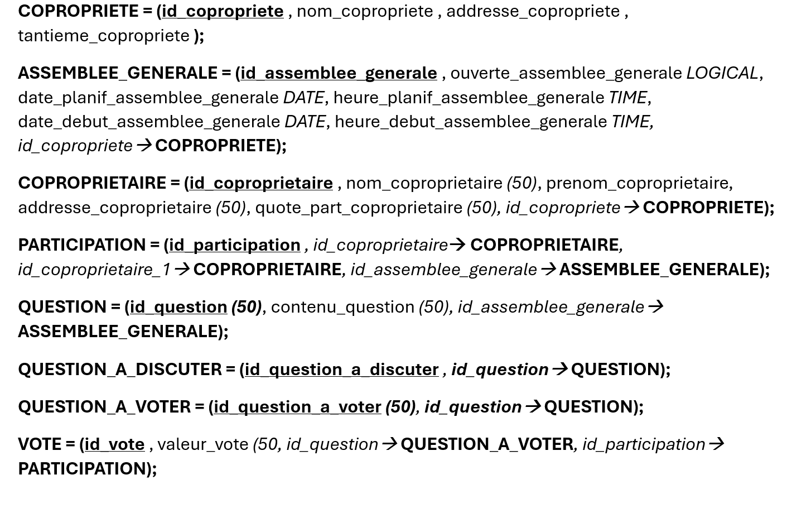

# 📋 ProcesVerbaux-app

Application web Symfony pour la gestion des assemblées générales de copropriétés, incluant la gestion des copropriétaires, des votes et des procès-verbaux.

## Nouveau MLD



## 🚀 Installation et lancement rapide

### Prérequis
- PHP
- Composer
- Symfony CLI

### Installation
```bash
# Cloner le projet
git clone https://github.com/Karene01/ProcesVerbaux-app.git
cd ProcesVerbaux-app

# Se placer sur le dépôt dev
git switch dev

# Installer les dépendances
composer install

# Configurer la base de données
php bin/console doctrine:database:create
php bin/console doctrine:migrations:migrate

# Charger les fixtures (données de test)
php bin/console doctrine:fixtures:load

# Installer le bundle bootstrap
symfony composer require camurphy/bootstrap-menu-bundle
```

### Lancement du site
```bash
# Démarrer le serveur de développement
symfony server:start
```
Le site sera accessible à l'adresse : http://localhost:8000/login

## 🔐 Authentification

### Utilisateurs de test
- **Utilisateur** : `achok@localhost` / `achok`
- **Admin** : `tahiana@localhost` / `tahiana`

### Sécurité
- ✅ Connexion obligatoire pour accéder au site

## 📋 Fonctionnalités développées

### Gestion des copropriétés
✅ Interface CRUD complète  
✅ Affichage en tableau avec design Bootstrap  
✅ Badges pour les identifiants et tantièmes  
✅ Boutons d'actions stylisés  

### Gestion des copropriétaires
✅ Interface CRUD complète  
✅ Affichage des quotes-parts  
✅ Design moderne avec cards Bootstrap  
✅ Validation des formulaires  

### Gestion des assemblées générales
✅ Création et modification d'assemblées  
✅ Gestion des statuts (ouverte/fermée)  
✅ Interface de visualisation détaillée  
✅ Intégration des questions et participants  

### Gestion des participations
✅ Ajout de présences  
✅ Gestion des mandataires  
✅ Interface intuitive avec JavaScript  

### Gestion des questions
✅ Questions à voter  
✅ Questions à discuter  
✅ Association aux assemblées  

### Gestion des votes
✅ Interface de vote  
✅ Calcul des résultats (Pour/Contre/Abstention)  
✅ Affichage graphique des statistiques  

## 🎨 Interface utilisateur

### Design et UX
- **Framework CSS** : Bootstrap 5
- **Navigation** : Menu Bootstrap avec rôles
- **Formulaires** : Validation HTML5 + design Bootstrap
- **Couleurs** : Palette sobre et professionnelle

### Composants développés
- 📊 Tableaux stylisés
- 🔘 Boutons stylisés avec icônes
- 🏷️ Badges pour les statuts
- 📝 Formulaires en colonnes
- 📢 Messages d'état et notifications

## 🗂️ Structure technique

### Entités principales
- **Copropriete** : Gestion des bâtiments
- **Coproprietaire** : Gestion des propriétaires
- **AssembleeGenerale** : Gestion des réunions
- **Question** : Questions à discuter/voter
- **Participation** : Présences et représentations
- **Vote** : Enregistrement des votes
- **User** : Authentification

### Base de données
- **Type** : SQLite (fichier `pv.sqlite`)
- **ORM** : Doctrine
- **Migrations** : Gestion des modifications de schéma
- **Fixtures** : Données de test pour les utilisateurs

## 🛠️ Outils et dépendances

### Packages Symfony utilisés
- **Security** : Authentification et autorisation
- **Form** : Génération et validation de formulaires
- **Twig** : Moteur de templates
- **Doctrine** : ORM et gestion de base de données
- **BootstrapMenu** : Navigation dynamique

### Configuration
- **Environment** : Développement configuré
- **Assets** : Gestion des ressources statiques
- **Cache** : Configuration optimisée pour le développement

## 📝 Commandes utiles

### Base de données
```bash
# Créer la base de données
php bin/console doctrine:database:create

# Exécuter les migrations
php bin/console doctrine:migrations:migrate

# Charger les fixtures
php bin/console doctrine:fixtures:load

# Générer une nouvelle migration
php bin/console make:migration

# Voir le statut des migrations
php bin/console doctrine:migrations:status
```

### Cache et logs
```bash
# Vider le cache
php bin/console cache:clear

# Voir les logs en temps réel
symfony server:log

# Vider les logs
php bin/console app:clear-logs
```

### Debug
```bash
# Lister toutes les routes
php bin/console debug:router

# Informations sur un service
php bin/console debug:container <service>

# Valider le schéma de base
php bin/console doctrine:schema:validate

# Profiler web
symfony open:local --path=/_profiler
```


## 🤝 Contribution

Le projet utilise Git avec une branche `dev_a` pour le développement. La configuration email pour GitHub est configurée pour préserver la confidentialité.

---

**Projet développé dans le cadre du cours BDWA par Tahiana RAKOTONINDRINA et Achok SAMEDI**